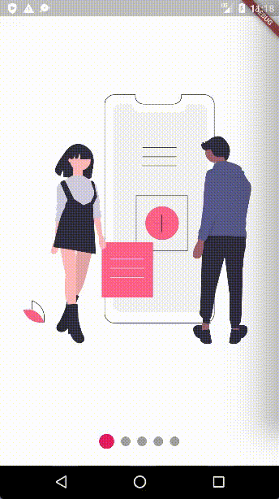

 [English](README.md) | [Português](resources/translation/pt_pt/README.md)

# flutter_carousel_intro

by:  [Eliezer António](https://github.com/eliezerantonio/)

see in Flutter Gems: <https://fluttergems.dev/packages/flutter_carousel_intro>


 Swipe the carousel to the current clicked indicator


## Current Features

- [X] Custom child widgets
- [X] Slide
- [X] Rotate transition
- [X] Auto play
- [X] Horizontal transition
- [X] Vertical transition
- [X] Swipe the carousel to the current clicked indicator
- [X] **Infinite loop (`repeat`)** — works for both autoplay and manual swipe
- [X] **Built-in navigation buttons** — `Skip`, `Next` and `Done`, fully customizable

## Supported Platforms

- Flutter Android
- Flutter iOS
- Flutter web
- Flutter desktop

## Preview

## Installation

Add `flutter_carousel_intro: ^1.0.13` to your `pubspec.yaml` dependencies. And import it:

```dart
import 'package:flutter_carousel_intro/flutter_carousel_intro.dart';
```

## How to use

```dart
FlutterCarouselIntro(  
       slides: [
          SliderItem(
            title: 'Title 1',
            subtitle: const Text('Lorem Ipsum is simply dummy text'),
            widget: SvgPicture.asset("assets/slide-1.svg"),
          ),
          SliderItem(
            title: 'Title 2',
            subtitle: const Text('Lorem Ipsum is simply dummy text'),
            widget: SvgPicture.asset("assets/slide-2.svg"),
          ),
          SliderItem(
            title: 'Title 3',
            subtitle: const Text('Lorem Ipsum is simply dummy text'),
            widget: SvgPicture.asset("assets/slide-3.svg"),
          ),
          SliderItem(
            title: 'Title 4',
            subtitle: const Text('Lorem Ipsum is simply dummy text'),
            widget: SvgPicture.asset("assets/slide-4.svg"),
          ),
          SliderItem(
            title: 'Title 5',
            subtitle: const Text('Lorem Ipsum is simply dummy text'),
            widget: SvgPicture.asset("assets/slide-5.svg"),
          ),
          SliderItem(
            title: 'Title 5',
            widget: SvgPicture.asset("assets/slide-6.svg"),
            subtitle: ElevatedButton(
              onPressed: () {},
              child: const Text("skip"),
            ),
          ),
        ],
    );
  ```

### All SliderItem parameters

```dart

  String? title,
  TextStyle? titleTextStyle,
  TextAlign? titleTextAlign,
  Widget? subtitle,
  
 ```
  
## Infinite loop (`repeat`)

Set `repeat: true` to turn the carousel into an infinite loop. It works
independently of `autoPlay` — the user can also swipe past the last slide
and wrap back to the first.

```dart
FlutterCarouselIntro(
  autoPlay: true,
  repeat: true,
  slides: [...],
);
```

Under the hood the `PageView` becomes infinite and the indicator is
synchronized via modulo, so the dots always reflect the current slide.

## Built-in navigation buttons (Skip / Next / Done)

For onboarding flows you no longer need to assemble the buttons by hand.
`FlutterCarouselIntro` ships with opt-in `Skip`, `Next` and `Done` buttons:

```dart
FlutterCarouselIntro(
  showNextButton: true,
  onSkip: () => Navigator.of(context).pushReplacementNamed('/home'),
  onDone: () => Navigator.of(context).pushReplacementNamed('/home'),
  skipLabel: const Text('Skip'),
  nextLabel: const Text('Next'),
  doneLabel: const Text('Done'),
  slides: [...],
);
```

Behavior:

- `Skip` is shown whenever `onSkip != null`.
- `Next` is shown when `showNextButton: true`; tapping it advances the page.
- On the last slide, `Next` is automatically replaced by `Done` (when
  `onDone` is provided).
- In `repeat: true` mode there is no last slide, so `Next` is always visible
  and `Done` is never triggered.

### All navigation button parameters

```dart
VoidCallback? onSkip;
VoidCallback? onDone;
bool showNextButton;              // default: false

Widget? skipLabel;                // default: Text('Skip')
Widget? nextLabel;                // default: Text('Next')
Widget? doneLabel;                // default: Text('Done')

ButtonStyle? navigationButtonStyle;

// Full overrides — replace the button widget entirely
NavigationButtonBuilder? skipButtonBuilder;
NavigationButtonBuilder? nextButtonBuilder;
NavigationButtonBuilder? doneButtonBuilder;

// Positioning
AlignmentGeometry skipButtonAlignment;   // default: Alignment.topRight
AlignmentGeometry nextButtonAlignment;   // default: Alignment.bottomRight
EdgeInsetsGeometry navigationButtonsPadding; // default: EdgeInsets.all(16)
```

`NavigationButtonBuilder` is
`Widget Function(BuildContext context, VoidCallback onPressed)`, giving you
full control over the rendered widget while the package still wires the tap
handler (advance / skip / done) for you:

```dart
FlutterCarouselIntro(
  showNextButton: true,
  onDone: _finish,
  nextButtonBuilder: (context, onPressed) => FilledButton.icon(
    onPressed: onPressed,
    icon: const Icon(Icons.arrow_forward),
    label: const Text('Continue'),
  ),
  doneButtonBuilder: (context, onPressed) => FilledButton(
    onPressed: onPressed,
    child: const Text("Let's go"),
  ),
  slides: [...],
);
```

## General Example

```dart
class MySlideShow extends StatelessWidget {
  const MySlideShow({Key? key}) : super(key: key);
  @override
  Widget build(BuildContext context) {
    return FlutterCarouselIntro(
        animatedRotateX: false,
        animatedRotateZ: true,
        scale: true,
        autoPlay: true,
        repeat: true,
        animatedOpacity: false,
        autoPlaySlideDuration: const Duration(seconds: 2),
        autoPlaySlideDurationTransition: const Duration(milliseconds: 1100),
        primaryColor: Colors.pink,
        secondaryColor: Colors.grey,
        scrollDirection: Axis.horizontal,
        indicatorAlign: IndicatorAlign.bottom,
        indicatorEffect: IndicatorEffects.jumping,
        showIndicators: true,
        showNextButton: true,
        onSkip: () => debugPrint('Skip tapped'),
        onDone: () => debugPrint('Done tapped'),
        skipLabel: const Text('Skip'),
        nextLabel: const Text('Next'),
        doneLabel: const Text('Done'),
         slides: [
          SliderItem(
            title: 'Title 1',
            subtitle: const Text('Lorem Ipsum is simply dummy text'),
            widget: SvgPicture.asset("assets/slide-1.svg"),
          ),
          SliderItem(
            title: 'Title 2',
            subtitle: const Text('Lorem Ipsum is simply dummy text'),
            widget: SvgPicture.asset("assets/slide-2.svg"),
          ),
          SliderItem(
            title: 'Title 3',
            subtitle: const Text('Lorem Ipsum is simply dummy text'),
            widget: SvgPicture.asset("assets/slide-3.svg"),
          ),
          SliderItem(
            title: 'Title 4',
            subtitle: const Text('Lorem Ipsum is simply dummy text'),
            widget: SvgPicture.asset("assets/slide-4.svg"),
          ),
          SliderItem(
            title: 'Title 5',
            subtitle: const Text('Lorem Ipsum is simply dummy text'),
            widget: SvgPicture.asset("assets/slide-5.svg"),
          ),
          SliderItem(
            title: 'Title 5',
            widget: SvgPicture.asset("assets/slide-6.svg"),
            subtitle: ElevatedButton(
              onPressed: () {},
              child: const Text("skip"),
            ),
          ),
        ],
      );
  }
}
  ```  

## Gif

Normal Example:


Animated Opacity




```dart
animatedOpacity: true
```

Animated Scale


```dart
scale: true
  ```

Animated Rotation on the X Axis


```dart
animatedRotateX: true
  ```
  
  Animated Rotation on the Z Axis


```dart
animatedRotateZ: true
  ```

## Contributions

Feel free to contribute to this project.

If you find a bug or want a feature, but don't know how to fix/implement it, please fill an [issue][issue].  
If you fixed a bug or implemented a feature, please send a [pull request][pr].

[issue]: https://github.com/eliezerantonio/flutter_carousel_intro/issues
[pr]: https://github.com/eliezerantonio/flutter_carousel_intro/pulls

## My Packages
  
  [Flutter Responsivity Widget](https://pub.dev/packages/flutter_responsivity_widget)
